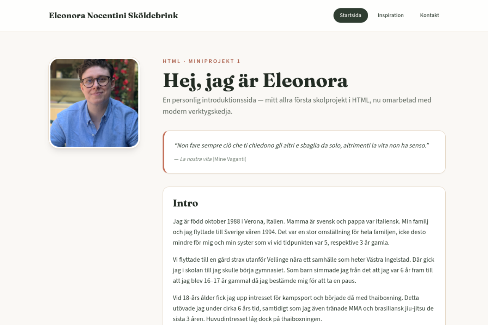

# HTML Miniproject 1

[](https://html-mp1.netlify.app)
[](https://developer.mozilla.org/en-US/docs/Web/HTML)
[](https://vitejs.dev/)
[](https://tailwindcss.com/)

My **first school project in HTML** — a small multi-page personal introduction site from an introductory front-end course (September 2022). The original hand-in is preserved on `version/original`; `main` is a modern static rebuild with the same content and routes.

**Live site:** [html-mp1.netlify.app](https://html-mp1.netlify.app)

## Preview



## Pages

| Page | Route | Content |
|------|-------|---------|
| Home | `/` | Introduction and background |
| Inspiration | `/inspirational.html` | People who inspire me |
| Contact | `/contact.html` | Simple contact form |

## Version history

| Branch | Description | Date |
|--------|-------------|------|
| `version/original` | First HTML school submission (plain HTML + CSS) | 2022-09-06 |
| `main` | Modern rebuild (Vite + Tailwind CSS) | 2026 |

```bash
git checkout version/original   # 2022 school version
git checkout main               # modern rebuild (deployed)
```

Tags: `v0-original` · `v2-modern`

## Tech stack (modern rebuild)

- [Vite](https://vitejs.dev/) — multi-page build (`index`, `inspirational`, `contact`)
- [Tailwind CSS](https://tailwindcss.com/) — layout and design tokens
- Semantic HTML, responsive layout, labelled form fields
- Hosted on [Netlify](https://www.netlify.com/) (`netlify.toml`)

## Local development

Prerequisites: Node.js 20+ and npm.

```bash
git clone https://github.com/Elli2022/html-mp1.git
cd html-mp1
npm install
npm run dev
```

Open the URL Vite prints (usually `http://localhost:5173`).

## Build & preview

```bash
npm run build
npm run preview
```

Production output is written to `dist/`.

## Deployment

Pushes to `main` are built and published by Netlify (see `netlify.toml`). GitHub Pages is no longer used for this repo.

## School context

- **Course:** Introductory HTML/CSS
- **Assignment:** Miniproject 1 — personal introduction site
- **Original stack:** HTML + CSS (no framework)
- **Modern rebuild:** static site with Vite + Tailwind, deployed from `main`

## License

Educational coursework — see repository history for the original submission date.
